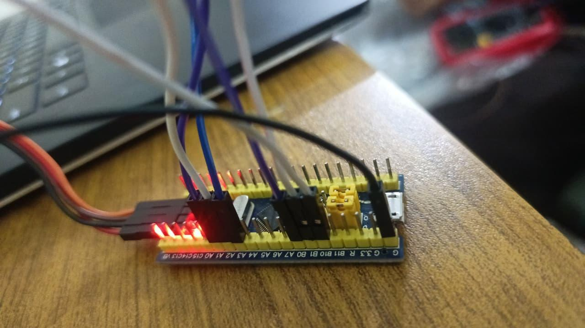
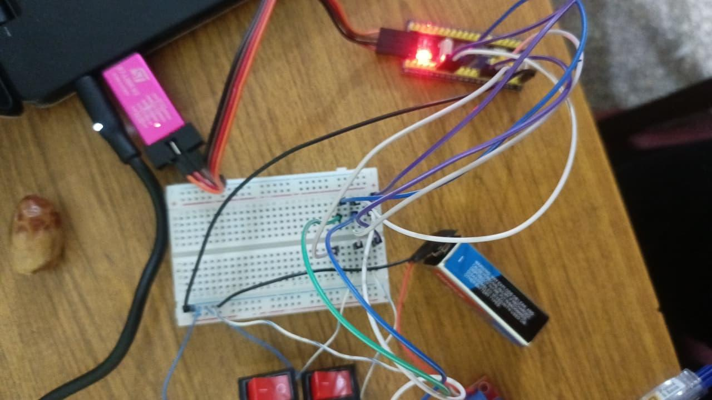
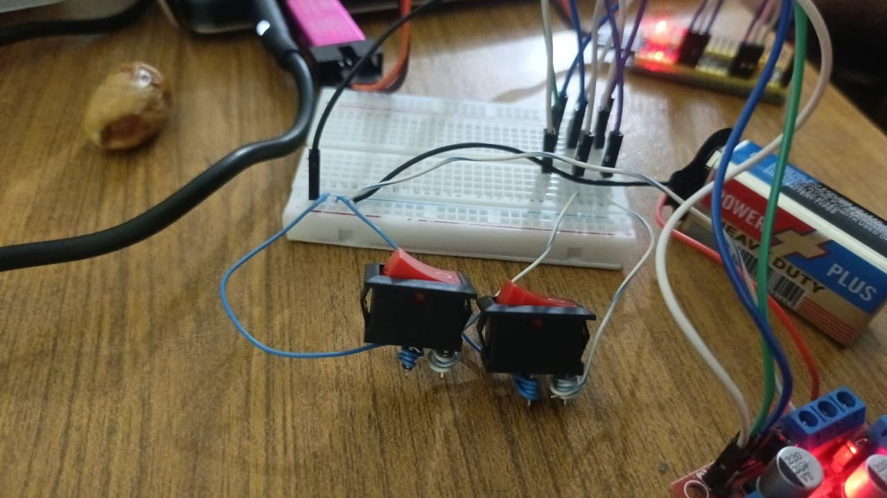
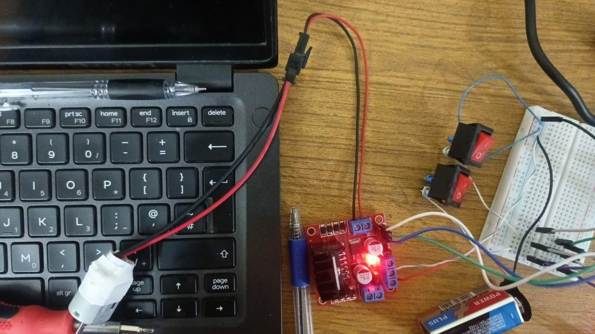

# STM32 DC Motor PWM Control

## Overview

This project demonstrates real-time DC motor speed control using PWM (Pulse Width Modulation) with the STM32F103C8T6 (Blue Pill). The system allows the user to control motor ON/OFF and adjust speed using push buttons.

---

## Features

*  Motor ON/OFF control using push button
*  Speed increase using button
*  Speed decrease using button
*  Efficient PWM-based motor control

---

## Working Principle

* PWM signal controls motor speed by varying duty cycle
* Three push buttons are used:

  * Button 1 → Toggle motor ON/OFF
  * Button 2 → Increase speed (increase duty cycle)
  * Button 3 → Decrease speed (decrease duty cycle)

---

## Hardware Used

* STM32F103C8T6 (Blue Pill)
* DC Motor
* Motor Driver (L298N / L293D)
* Push Buttons (3x)
* External Power Supply

---

## Pin Configuration

| Component      | STM32 Pin      |
| -------------- | -------------- |
| PWM Output     | PA1 (TIM2 CH2) |
| ON/OFF Button  | PB0            |
| Speed Increase | PB1            |
| Speed Decrease | PB10           |

---

## Circuit Connections

* STM32 PA1 → Motor driver PWM input ENB
* STM32 PB0 → ON/OFF push button
* STM32 PB1 → Speed increase button
* STM32 PB10 → Speed decrease button
* Motor driver output (OUT3 & OUT4) → DC motor
* External power supply used for motor
* STM32 powered via regulated supply

---

## Software Used

* STM32CubeMX
* Keil uVision
* Embedded C

---

## PWM Concept

* Duty Cycle ↑ → Motor Speed ↑
* Duty Cycle ↓ → Motor Speed ↓

---

##  Demo

### Hardware Setup

---

## 🎥 Project Demonstration Video

[Watch Motor Running Demo](https://drive.google.com/file/d/1DBJ4HqE5uqFQ9R1SAauPwjifIZeeNPna/view?usp=sharing)

---

## 💻 Code Highlights

- TIM2 PWM used to control DC motor speed
- Push buttons read as digital inputs
- ON/OFF button toggles motor state
- Increase button raises PWM duty cycle step-by-step
- Decrease button lowers PWM duty cycle step-by-step
- Duty cycle updated in software for smooth control
---

## Control Logic

- Motor state is toggled using the ON/OFF button.
- PWM duty cycle is increased in steps when the speed-up button is pressed.
- PWM duty cycle is decreased in steps when the speed-down button is pressed.
- The motor speed changes according to the applied PWM duty cycle.

## How to Run

1. Open the project in Keil uVision.
2. Build the project.
3. Flash the code to STM32F103C8T6 using ST-Link.
4. Connect the motor driver, push buttons, and motor according to the pin configuration.
5. Power the STM32 and motor driver.
6. Use the buttons to turn the motor ON/OFF and adjust speed.
   
## Project Outcome

This project successfully demonstrates practical implementation of embedded motor control using STM32. It highlights PWM generation, hardware interfacing, and real-time user input handling.

---

## Future Improvements

* Add LCD for speed display
* Implement PID control
* Add Bluetooth/WiFi control (ESP32)
* Mobile app integration

---

## Skills Demonstrated

* STM32 Embedded Programming
* PWM Generation
* Timer Configuration
* GPIO Interfacing
* Push Button Handling
* DC Motor Control
* Embedded C
* STM32CubeMX
* Keil uVision

---

## 👨‍💻 Author

Saqib Ishaq – Electrical Engineering Student (PIEAS)
